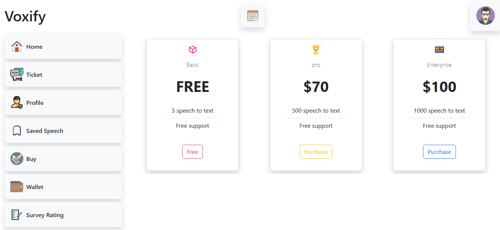

# 🎛️ Voxify Dashboard

A custom dashboard for the Voxify web application, providing real-time insights and management for voice-to-text conversions.

## 🚀 Features
- 📊 Real-time statistics on voice-to-text usage  
- 🧑‍💻 User management overview  
- 📝 Conversion history and logs  
- 🖥️ Responsive and interactive design  

## 🖼️ Screenshot
Here is a preview of the dashboard:



## 🛠️ Tech Stack
- HTML  
- CSS  
- JavaScript  
- Bootstrap  

## 📂 Project Structure
```
voxify-dashboard/
├── dashboard.html
├── dashboard.css
├── dashboard.js
├── bootstrap.min.css
├── bootstrap.bundle.min.js
├── picture/
│   └── [all images used in the dashboard]
├── screenshots/
│   └── dashboard.png
└── svg/
    └── [all SVG files used in the dashboard]
```


## 📦 Installation & Usage
1. Clone the repository:
   
```bash
   git clone https://github.com/dvlprpy/voxify-dashboard.git
   cd voxify-dashboard
```
